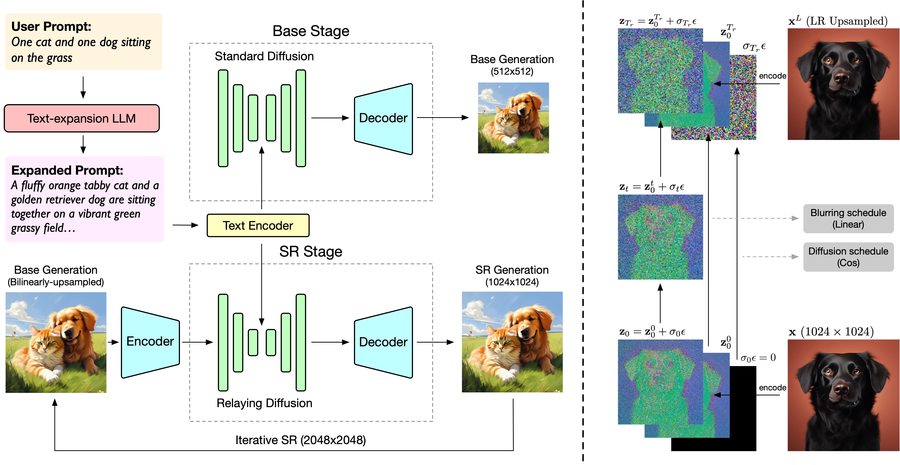
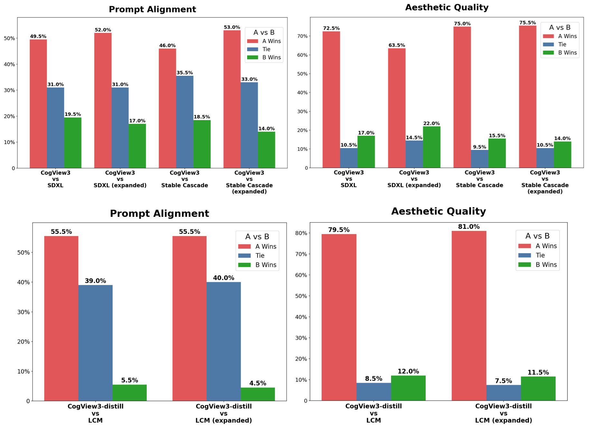

# CogView3 & CogView-3Plus

[Read this in Chinese](./README_zh.md)

<div align="center">

</div>

<p align="center">
Experience the CogView3-Plus-3B model online on <a href="https://huggingface.co/spaces/THUDM-HF-SPACE/CogView3-Plus-3B-Space" target="_blank"> 🤗 Huggingface Space</a>
</p>
<p align="center">
📚 Check out the <a href="https://arxiv.org/abs/2403.05121" target="_blank">paper</a>
</p>
<p align="center">
    👋 Join our <a href="resources/WECHAT.md" target="_blank">WeChat</a>
</p>
<p align="center">
📍 Visit <a href="https://chatglm.cn/main/gdetail/65a232c082ff90a2ad2f15e2?fr=osm_cogvideox&lang=zh">Qingyan</a> and <a href="https://open.bigmodel.cn/?utm_campaign=open&_channel_track_key=OWTVNma9">API Platform</a> for larger-scale commercial video generation models.
</p>

## Project Updates

- 🔥🔥 ```2024/10/13```: We have adapted and open-sourced the **CogView-3Plus-3B** model in the [diffusers](https://github.com/huggingface/diffusers) version. You can [experience it online](https://huggingface.co/spaces/THUDM-HF-SPACE/CogView3-Plus-3B-Space).
- 🔥 ```2024/9/29```: We have open-sourced **CogView3** and **CogView-3Plus-3B**. **CogView3** is a text-to-image system based on cascaded diffusion, utilizing a relay diffusion framework. **CogView-3Plus** is a series of newly developed text-to-image models based on Diffusion Transformers.

## Model Introduction

CogView-3-Plus builds upon CogView3 (ECCV'24) by introducing the latest DiT framework for further overall performance
improvements. CogView-3-Plus uses the Zero-SNR diffusion noise scheduling and incorporates a joint text-image attention
mechanism. Compared to the commonly used MMDiT structure, it effectively reduces training and inference costs while
maintaining the model's basic capabilities. CogView-3Plus utilizes a VAE with a latent dimension of 16.

The table below shows the list of text-to-image models we currently offer along with their basic information.
At present, all models are only available in the [SAT](https://github.com/THUDM/SwissArmyTransformer) version, but we
are participating in the development of the diffusers version.

<table style="border-collapse: collapse; width: 100%;">
  <tr>
    <th style="text-align: center;">Model Name</th>
    <th style="text-align: center;">CogView3-Base-3B</th>
    <th style="text-align: center;">CogView3-Base-3B-distill</th>
    <th style="text-align: center;">CogView3-Plus-3B</th>
  </tr>
  <tr>
    <td style="text-align: center;">Model Description</td>
    <td style="text-align: center;">The base and relay stage models of CogView3, supporting 512x512 text-to-image generation and 2x super-resolution generation.</td>
    <td style="text-align: center;">The distilled version of CogView3, with 4 and 1 step sampling in two stages (or 8 and 2 steps).</td>
    <td style="text-align: center;">The DiT version image generation model, supporting image generation ranging from 512 to 2048.</td>
  </tr>
  <tr>
    <td style="text-align: center;">Resolution</td>
    <td colspan="2" style="text-align: center;">512 * 512</td>
    <td style="text-align: center;">
            512 <= H, W <= 2048 <br>
            H * W <= 2^{21} <br>
            H, W \mod 32 = 0
    </td>
  </tr>
  <tr>
    <td style="text-align: center;">Inference Precision</td>
    <td colspan="2" style="text-align: center;"><b>FP16 (recommended)</b>, BF16, FP32</td>
    <td style="text-align: center;"><b>BF16* (recommended)</b>, FP16, FP32</td>
  </tr>
  <tr>
    <td style="text-align: center;">Memory Usage (bs = 4)</td>
    <td style="text-align: center;"> 17G </td>
    <td style="text-align: center;"> 64G </td>
    <td style="text-align: center;"> 30G (2048 * 2048) <br> 20G (1024 * 1024) </td>
  </tr>
  <tr>
    <td style="text-align: center;">Prompt Language</td>
    <td colspan="3" style="text-align: center;">English*</td>
  </tr>
  <tr>
    <td style="text-align: center;">Maximum Prompt Length</td>
    <td colspan="2" style="text-align: center;">225 Tokens</td>
    <td style="text-align: center;">224 Tokens</td>
  </tr>
  <tr>
    <td style="text-align: center;">Download Link (SAT)</td>
    <td colspan="3" style="text-align: center;"><a href="./sat/README.md">SAT</a></td>
  </tr>
  <tr>
    <td style="text-align: center;">Download Link (Diffusers)</td>
    <td colspan="2" style="text-align: center;">Not Adapted</td>
    <td style="text-align: center;">
        <a href="https://huggingface.co/THUDM/CogView3-Plus-3B">🤗 HuggingFace</a><br>
        <a href="https://modelscope.cn/models/ZhipuAI/CogView3-Plus-3B">🤖 ModelScope</a><br>
        <a href="https://wisemodel.cn/models/ZhipuAI/CogView3-Plus-3B">🟣 WiseModel</a>
    </td>
</tr>
</table>

**Data Explanation**

+ All inference tests were conducted on a single A100 GPU with a batch size of 4,
  using `PYTORCH_CUDA_ALLOC_CONF=expandable_segments:True` to save memory.
+ The models only support English input. Other languages can be translated into English when refining with large models.
+ This test environment uses the `SAT` framework. Many optimization points are not yet complete, and we will work with
  the community to create a version of the model for the `diffusers` library. Once the `diffusers` repository is
  supported, we will test using `diffusers`. The release is expected in November 2024.

## Quick Start

### Prompt Optimization

Although CogView3 series models are trained with long image descriptions, we highly recommend rewriting prompts using
large language models (LLMs) before generating text-to-image, as this will significantly improve generation quality.

We provide an [example script](prompt_optimize.py). We suggest running this script to refine the prompt:

```shell
python prompt_optimize.py --api_key "Zhipu AI API Key" --prompt {your prompt} --base_url "https://open.bigmodel.cn/api/paas/v4" --model "glm-4-plus"
```

### Inference Model (Diffusers)

First, ensure the `diffusers` library is installed **from source**. 
```
pip install git+https://github.com/huggingface/diffusers.git
```

Then, run the following code:

```python
from diffusers import CogView3PlusPipeline
import torch

pipe = CogView3PlusPipeline.from_pretrained("THUDM/CogView3-Plus-3B", torch_dtype=torch.float16).to("cuda")

# Enable it to reduce GPU memory usage
pipe.enable_model_cpu_offload()
pipe.vae.enable_slicing()
pipe.vae.enable_tiling()

prompt = "A vibrant cherry red sports car sits proudly under the gleaming sun, its polished exterior smooth and flawless, casting a mirror-like reflection. The car features a low, aerodynamic body, angular headlights that gaze forward like predatory eyes, and a set of black, high-gloss racing rims that contrast starkly with the red. A subtle hint of chrome embellishes the grille and exhaust, while the tinted windows suggest a luxurious and private interior. The scene conveys a sense of speed and elegance, the car appearing as if it's about to burst into a sprint along a coastal road, with the ocean's azure waves crashing in the background."
image = pipe(
    prompt=prompt,
    guidance_scale=7.0,
    num_images_per_prompt=1,
    num_inference_steps=50,
    width=1024,
    height=1024,
).images[0]

image.save("cogview3.png")
```

For more inference code, please refer to [inference](inference/cli_demo.py). This folder also contains a simple WEBUI code wrapped with Gradio.

### Inference Model (SAT)

Please check the [sat](sat/README.md) tutorial for step-by-step instructions on model inference.

### Open Source Plan

Since the project is in its early stages, we are working on the following:

+ [ ] Fine-tuning the SAT version of CogView3-Plus-3B, including SFT and LoRA fine-tuning
+ [X] Inference with the Diffusers library version of the CogView3-Plus-3B model
+ [ ] Fine-tuning the Diffusers library version of the CogView3-Plus-3B model
+ [ ] Related work for the CogView3-Plus-3B model, including ControlNet and other tasks.

## CogView3 (ECCV'24)

Official paper
repository: [CogView3: Finer and Faster Text-to-Image Generation via Relay Diffusion](https://arxiv.org/abs/2403.05121)

CogView3 is a novel text-to-image generation system using relay diffusion. It breaks down the process of generating
high-resolution images into multiple stages. Through the relay super-resolution process, Gaussian noise is added to
low-resolution generation results, and the diffusion process begins from these noisy images. Our results show that
CogView3 outperforms SDXL with a winning rate of 77.0%. Additionally, through progressive distillation of the diffusion
model, CogView3 can generate comparable results while reducing inference time to only 1/10th of SDXL's.




Comparison results from human evaluations:



## Citation

🌟 If you find our work helpful, feel free to cite our paper and leave a star.

```
@article{zheng2024cogview3,
  title={Cogview3: Finer and faster text-to-image generation via relay diffusion},
  author={Zheng, Wendi and Teng, Jiayan and Yang, Zhuoyi and Wang, Weihan and Chen, Jidong and Gu, Xiaotao and Dong, Yuxiao and Ding, Ming and Tang, Jie},
  journal={arXiv preprint arXiv:2403.05121},
  year={2024}
}
```

We welcome your contributions! Click [here](resources/contribute.md) for more information.

## Model License

This codebase is released under the [Apache 2.0 License](LICENSE).

The CogView3-Base, CogView3-Relay, and CogView3-Plus models (including the UNet module, Transformers module, and VAE
module) are released under the [Apache 2.0 License](LICENSE).
